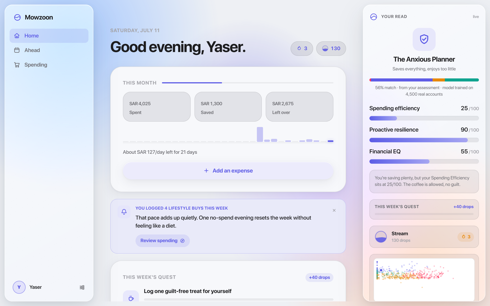
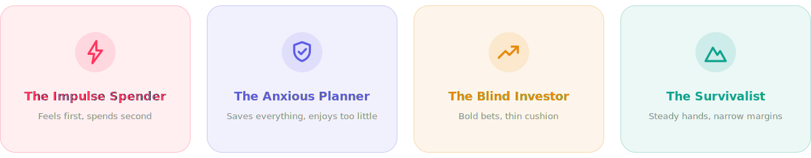
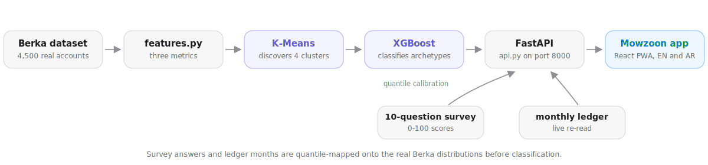
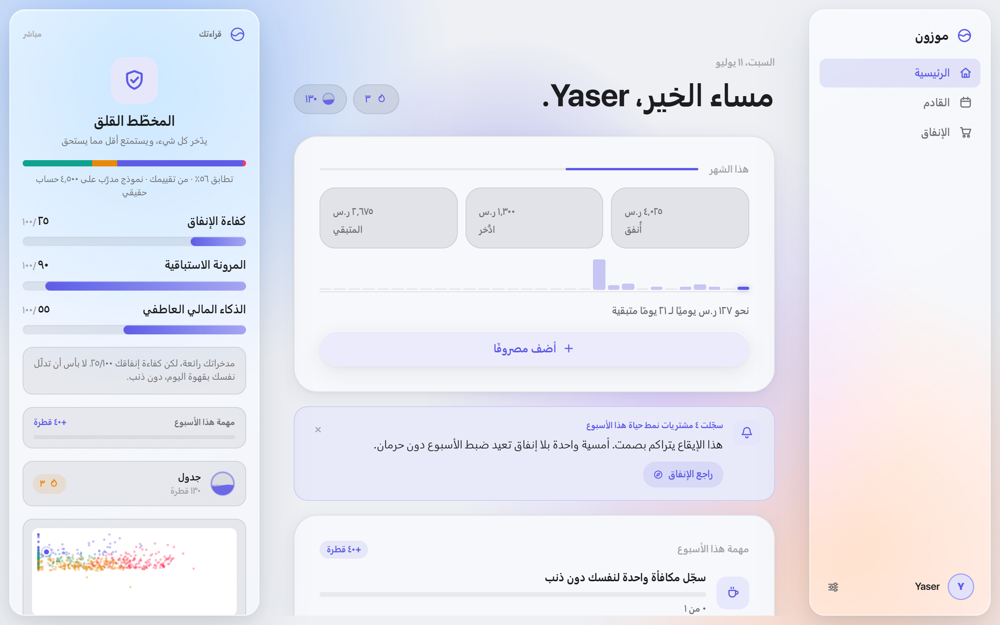
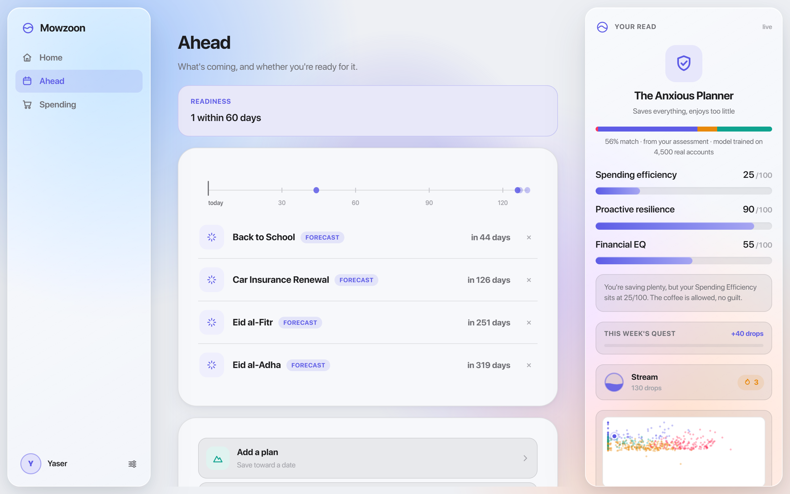
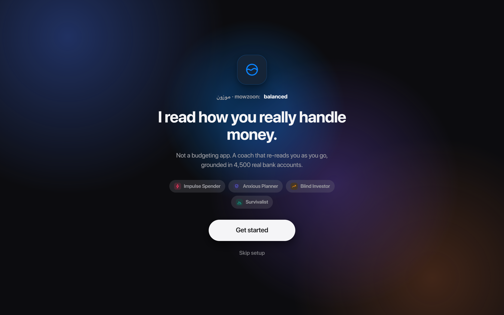
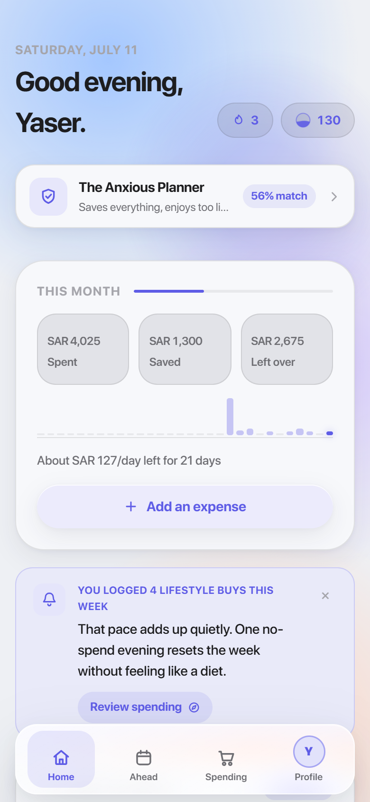

<picture>
  <source media="(prefers-color-scheme: dark)" srcset="docs/banner-dark.svg">
  
</picture>

A financial coach that reads how you actually behave with money, not just where it goes. Built at the Amad Hackathon.

Mowzoon classifies you into one of four money archetypes, tracks three living scores (spending efficiency, proactive resilience, financial EQ), and coaches you day to day: one nudge, a weekly quest, and a forecast of the spending spikes ahead of you. English and Arabic with full RTL, light and dark mode, installable as a PWA. Amounts are in SAR and the forecast calendar is Saudi (both Eids, back to school, insurance renewal).

<picture>
  <source media="(prefers-color-scheme: dark)" srcset="docs/home-dark.png">
  
</picture>


## The archetypes

Four behaviour patterns the model finds in real accounts. The environment takes the tint of whoever you are today, and the read updates live as you log.



## How the model works

<picture>
  <source media="(prefers-color-scheme: dark)" srcset="docs/pipeline-dark.svg">
  
</picture>

`mowzoon/` is a FastAPI service (port 8000) around a pipeline trained on the Berka dataset: 4,500 real bank accounts with a full year of transactions each.

- `features.py` scores every account on the three metrics.
- K-Means (k=4) discovers the behaviour clusters, centroid heuristics map them to the archetypes, and an XGBoost classifier is trained on those labels.
- Survey answers are quantile-mapped onto the real feature distributions before classification, so a 0-100 score lands inside the actual clusters instead of outside all of them.
- The archetype mix shown in the UI comes from Gaussian affinity to the cluster centroids, because raw XGBoost probabilities saturate near 1.0.

Once you log enough real spending in a month, the ledger takes over from the survey and the model re-reads you live.


## A look around

| | |
| :---: | :---: |
|  |  |
| Arabic, fully mirrored | Ahead: the Saudi spike forecast |

<table align="center">
  <tr>
    <td align="center" width="66%"></td>
    <td align="center" width="34%"></td>
  </tr>
  <tr>
    <td align="center">The front door</td>
    <td align="center">The phone shell</td>
  </tr>
</table>


## Data source

Transactions enter through `data_ingestor.py`. For the hackathon that is the Berka dataset; the same pipeline runs unchanged on a bank transaction feed, which is where the bank's API would plug in. The sample month in the UI plays that role in the meantime.

## Running it

Backend:

```
cd mowzoon
pip install -r requirements.txt
python api.py
```

The first run trains and caches artifacts under `data/`, later runs load them.

UI:

```
cd mowzoon-ui
npm install
npm run dev
```

The app runs at http://localhost:5173 and also works without the backend: it falls back to on-device scoring and shows an offline pill until the server answers.

## Next

- Link real accounts through the bank's open banking API, replacing the sample month
- Deliver the daily nudge as a push notification
- Persist profiles server-side once accounts are linked
