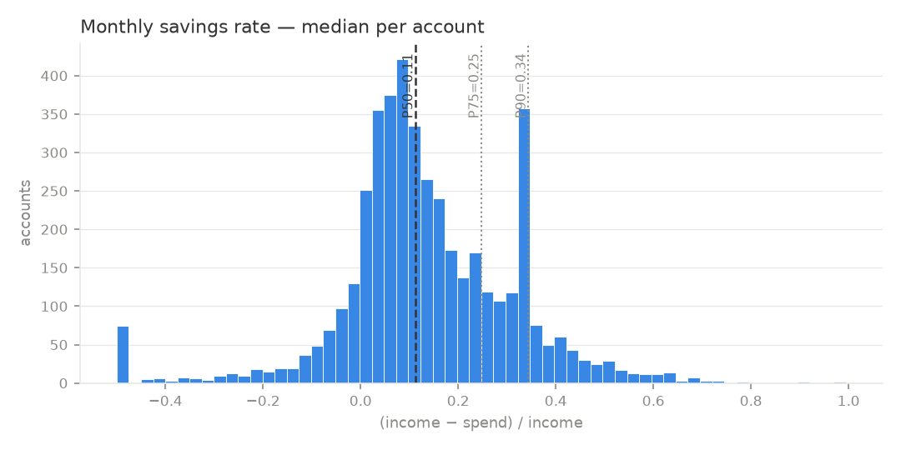
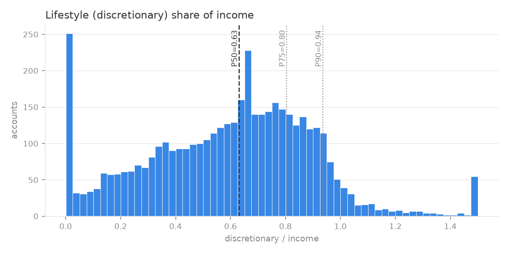
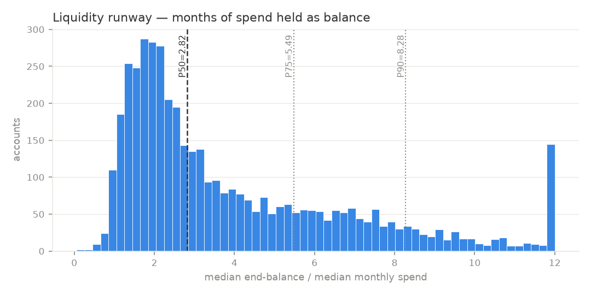
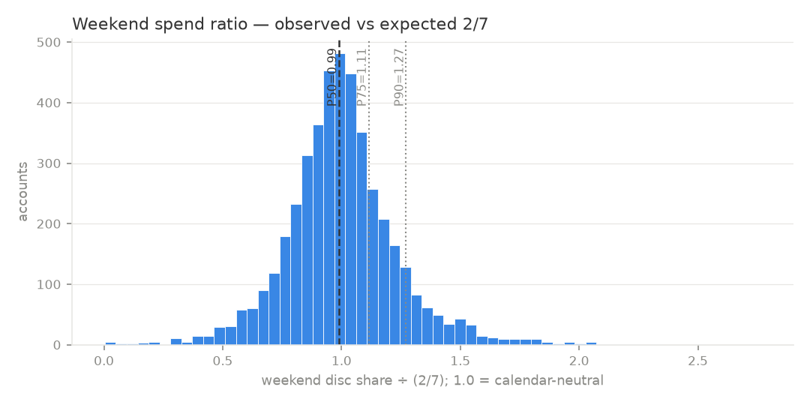
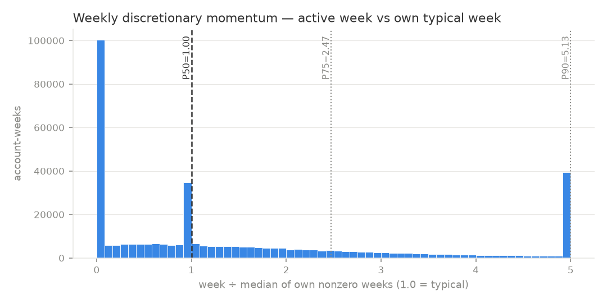
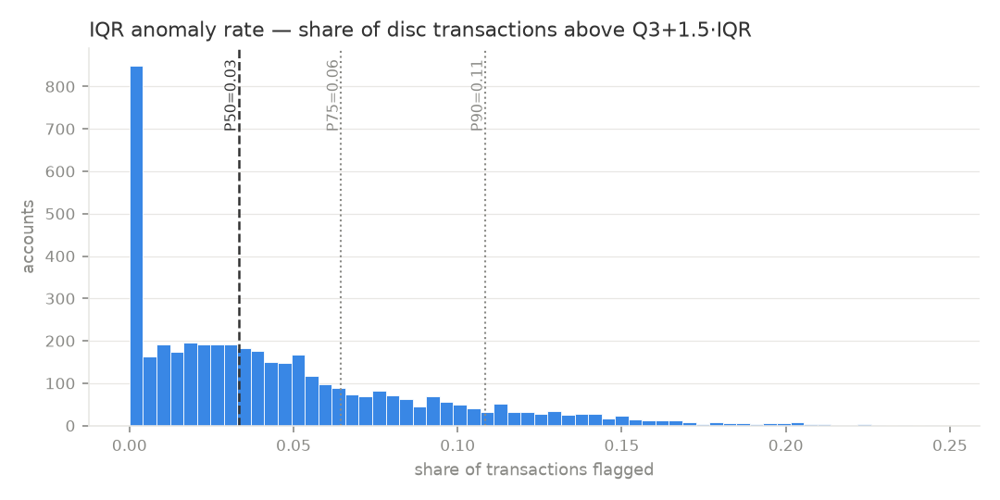

# Berka Ledger Profiling — empirical thresholds for the L1 signals

> **Purpose:** derive honest, distribution-based starting thresholds for the 7 L1 signals —
> measured, not guessed — in the **app's own ledger schema**, since that is what the backend
> will receive. Produced during threshold calibration for the signal layer.
>
> **Data:** Berka (PKDD'99), 1M transactions; **4,417 accounts** profiled (≥6 active months).
> **Date:** 2026-07-13 · Raw percentiles: [thresholds.json](thresholds.json)

---

## 1. Method: Berka → app schema mapping

| App ledger concept | Berka mapping |
|---|---|
| income | `PRIJEM` credits, per month |
| `fixed` | debits with `k_symbol ∈ {POJISTNE, SIPO, LEASING, UVER}` |
| `discretionary` | all other debits (incl. `VYBER` cash rows) |
| `savings` | unspent income: `income − spend` |
| `spike` | proxy: months where spend > Q3 + 1.5·IQR of the account's own monthly spend |

**Caveats (stated up front):**
1. Berka "discretionary" includes cash withdrawals that in reality paid for essentials
   (1990s cash economy), so **lifestyle share is over-estimated, essential share under-estimated.**
   Treat allocation thresholds as *population-relative*, not absolute 50/30/20 judgments.
2. Foreign/dated placeholder data (evidence-base §9). All thresholds here are **starting values**
   to re-tune on real user data.
3. ~50% of account-weeks have zero logged discretionary activity (cash era). In-app logging will
   be denser; momentum thresholds should be revisited once real logs exist.

---

## 2. Results — percentile tables (per-account medians unless noted)

| Signal | P10 | P25 | **P50** | P75 | P90 | n |
|---|---|---|---|---|---|---|
| Savings rate | −0.03 | 0.04 | **0.11** | 0.25 | 0.34 | 4,417 |
| Lifestyle share of income | 0.15 | 0.38 | **0.63** | 0.80 | 0.94 | 4,417 |
| Essential share of income | 0.00 | 0.03 | **0.26** | 0.46 | 0.62 | 4,417 |
| Runway (months of spend held) | 1.34 | 1.84 | **2.82** | 5.49 | 8.28 | 4,417 |
| Weekend ratio (1.0 = calendar-neutral) | 0.74 | 0.87 | **0.99** | 1.11 | 1.27 | 4,417 |
| Weekly momentum (vs own typical week) | 0.00 | 0.04 | **1.00** | 2.47 | 5.13 (P95 = 8.90) | 373k wks |
| IQR anomaly rate (share of tx flagged) | 0.00 | 0.01 | **0.03** | 0.07 | 0.11 | 4,352 |
| Spike-month share | 0.00 | 0.02 | **0.05** | 0.08 | 0.11 | 4,417 |

### Headline findings

1. **The CFPB 3–6-month runway band is real in this data.** Median runway = 2.8 months; the
   3–6-month "healthy buffer" band spans ~P52–P77 of the population. The normative anchor and
   the empirical distribution agree — strong justification for using runway as a core signal.
2. **The 20% savings-rate target sits at ~P70.** Median saver keeps 11%; 20% is ambitious-but-
   attainable (roughly "top third"), exactly where a stretch goal should sit. Also: P10 is
   *negative* — a real dissaving segment exists (Survivalist-relevant).
3. **Weekend ratio is tightly centred on 1.0** (P25–P75 = 0.87–1.11). Deviation is therefore
   *informative*: a user at ≥1.25 is genuinely top-decile weekend-skewed — a clean, honest
   trigger for the Impulse Spender's defining pattern.
4. **Momentum: an "elevated" week ≈ 2.5× your typical week (P75); a "hot" week ≈ 5× (P90).**
   Methodological note: the naive rolling-baseline version exploded (P90 ≈ 397) on sparse weeks;
   the metric must be **normalized to the median of the user's own nonzero weeks** (v2, used here).
   This finding directly shapes `signals.py`.
5. **Anomaly flags are naturally rare** — median account has ~3% of discretionary transactions
   above the IQR fence. So an anomaly ping is *by construction* an infrequent event (good for
   notification hygiene / JITAI "do nothing" discipline).

---

## 3. Recommended v1 severity bands (for `signals.py`)

Bands blend the empirical percentiles with the normative anchors (CFPB, 50/30/20). Convention:
**calm → note → elevated → high** (positive framing — bands describe *signal strength*, never
user blame).

| Signal | calm | note | elevated | high | Anchor logic |
|---|---|---|---|---|---|
| Savings rate | ≥ 0.20 | 0.11–0.20 | 0.04–0.11 | < 0.04 (esp. < 0) | 20% target ≈ P70; median & P25 as steps |
| Runway (months) | ≥ 6 | 3–6 | 1.8–3 | < 1.8 | CFPB 3–6 band; P25 as floor |
| Lifestyle share | < 0.38 | 0.38–0.63 | 0.63–0.80 | > 0.80 | population quartiles (see caveat 1) |
| Weekend ratio | 0.87–1.11 | 1.11–1.25 | 1.25–1.5 | > 1.5 | IQR band; P90 ≈ 1.27 |
| Momentum (week vs typical) | ≤ 1.5 | 1.5–2.5 | 2.5–5 | > 5 | P75 / P90 |
| Anomaly (per tx) | — | — | > Q3+1.5·IQR (own history) | > Q3+3·IQR | standard fences |
| Spike-month share | ≤ 0.05 | 0.05–0.08 | 0.08–0.11 | > 0.11 | population quartiles |

**Directionality is archetype-dependent (L2's job, not L1's):** e.g. savings rate *high* band is
"risk" for a Survivalist but the *opposite* end (extreme saving + very low lifestyle share) is the
Anxious Planner's watch zone. L1 only reports the band; L2 assigns meaning.

---

## 4. Distributions

*(Note: extreme tails are clipped for display; the clip accumulates in the outermost bar —
e.g. the −0.5 bar in savings rate. Percentile labels are computed on unclipped data.)*

---

## 5. What this feeds

- **The signal layer (`signals.py`):** the severity-band table above becomes the threshold config;
  momentum uses the v2 nonzero-week normalization; anomaly fences are per-user, not global.
- **Evidence base:** findings 1–2 (CFPB coherence) strengthen §4.2 with an in-house replication
  on real accounts.
- **Re-tuning path:** every threshold is a named constant; when real user data arrives, this same
  script re-derives the table.
